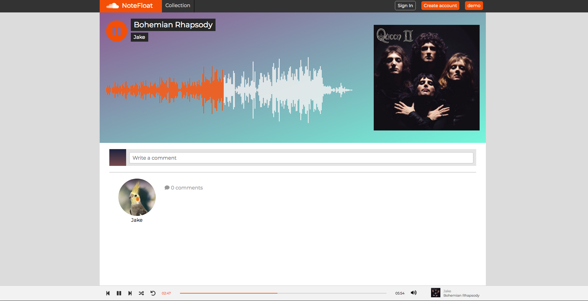
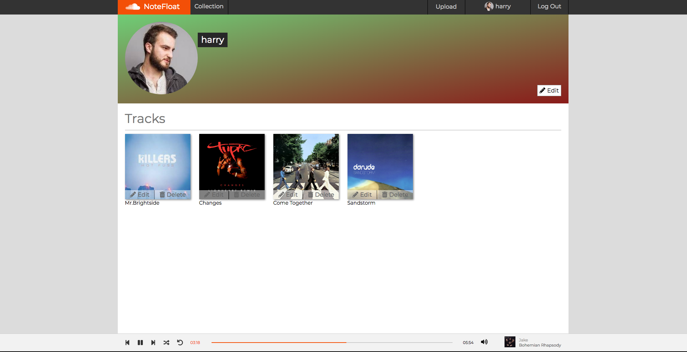

# NoteFloat 

[Live Demo][heroku]

[heroku]: https://notefloat.herokuapp.com/#/

NoteFloat is a SoundCloud inspired web application. Users can listen to, create, edit, and delete music. As well 
as create and edit profile.

The backend is implemented using Rails, with a combination of ActiveStorage and AWS to manage user uploads.
The frontend uses React and Redux to handle state.

## Custom Audio Bar/ Continous Play 
------

The HTML5 audio tag is notoriously uncustomizable. I made my own audio component that gave me all the utility and styling I was
looking for, as follows: 

* A styled audio / volume bar
    * I accomplished this by having two div elements follow the progression of the track by percent completion
* The ablitity to seek through the current track
    * I accomplished this by having a transparent `input[type=range]` element with a z-index greater than and directly on top of my div
* The ability to go to the next or previous track on click
    * I accomplished this by having a queue of both tracks and upcoming tracks
* Allows the user to repeat, shuffle, and mute tracks

```javascript
setTime(e) {
    this.audioRef.current.currentTime = e.target.value;
    this.setState({ currentTime: e.target.value });
}

<div className="progress-bar">
    <input type="range" className="music-progress-bar" min="0" max={length} step="0.25" onChange={this.setTime}/>
    <div className="outer-music-bar">
        <div className="inner-music-bar" style={{width: `${100*(currentTime/length) || 1}%`}}></div>
        <div className="progress-ball" style={{ left: `${100 * (currentTime / length) || 1}%` }}></div>
    </div>
</div>
```

For continous play, I created a seperate slice of state to hold the current track, as well as a queue 
that holds ids of the tracks that have been played and upcoming tracks.

```javascript
nextTrack() {
    const { queue, queuePos, currentTrack, fetchNextTrack, nextInQueue, fetchRandomNextTrack } = this.props;
    if (this.state.loop) this.audioRef.current.currentTime = 0;
    else if (queuePos === queue.length - 1) {
        if (this.state.shuffle) fetchRandomNextTrack();
        else fetchNextTrack(currentTrack.genre);
    }
    else nextInQueue(queue[queuePos+1]);
    this.audioRef.current.currentTime = 0;
}

case RECEIVE_NEXT_TRACK:
    newState.currentTrack = action.track;
    newState.queue.push(action.track.id);
    newState.queuePos = newState.queue.length - 1;
    newState.time = 0;
    return newState;
```

## WaveForm / WaveForm Seek
------



A track's waveform, a depiction of decibel-level over time, is displayed on the track's show page. This waveform progresses along with the progress bar. 
I created the waveform using the wavesurfer package, but changed its functionality. Rather than the waveform playing the audio, I sent the current
time of the track from the progress bar to the waveform component.

```javascript
componentDidUpdate(prevProps) {
    if (this.props.currentTrack && this.props.track.id === this.props.currentTrack.id) {
      if (prevProps.time !== this.props.time) {
        this.waveSurfer.seekTo(this.props.time / this.props.length);
      }
    }
    else {
      this.waveSurfer.seekTo(0);
    }
}
```

Users can seek to a certain point and play a track by clicking on its waveform. I accomplished this by turning on 
the seek event listener on click, and immediately turning it off in the same callback.

```javascript
handleClick(e) {
    this.waveSurfer.on('seek', this.handleChange);
}
  
handleChange(e) {
    if (this.props.currentTrack.id !== this.props.track.id) {
      this.props.receiveNextTrack(this.props.track);
    }
    this.props.setWaveTime(this.waveSurfer.getCurrentTime());
    this.waveSurfer.un('seek', this.handleChange);
}
```

## Track CRUD
------



Only logged in users can upload and comment on tracks. Both frontend and backend validations guarantee that only the user who created a track can edit and delete it. 
On track upload, frontend validations ensure that audio files aren't too large.

```javascript
const file = e.target.files[0];
const objectURL = URL.createObjectURL(file);
const audio = new Audio([objectURL]); 
const that = this;
var timer = setInterval(function () {
    if (audio.readyState === 4) {
    that.setState({ length: Math.floor(audio.duration)});
    clearInterval(timer);
    }
}, 500);
this.setState({ [feild]: file });
```